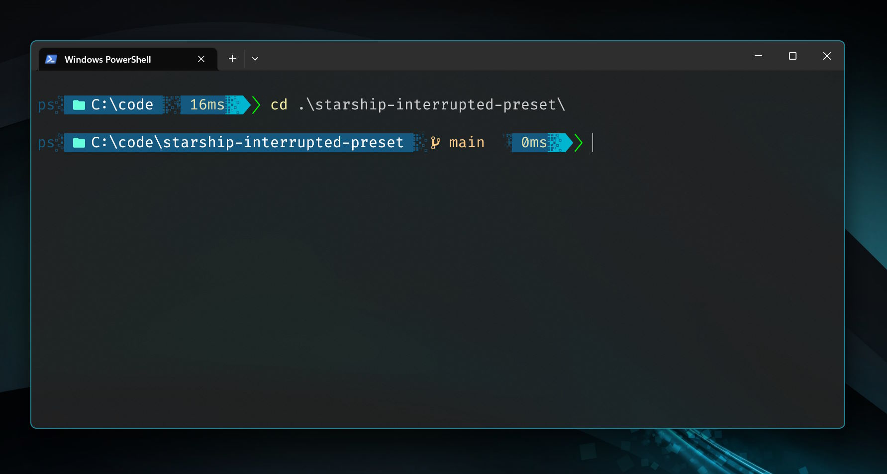
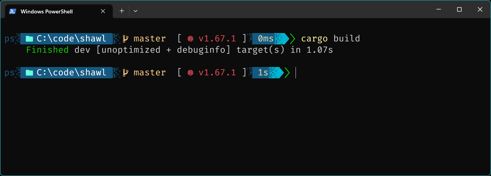
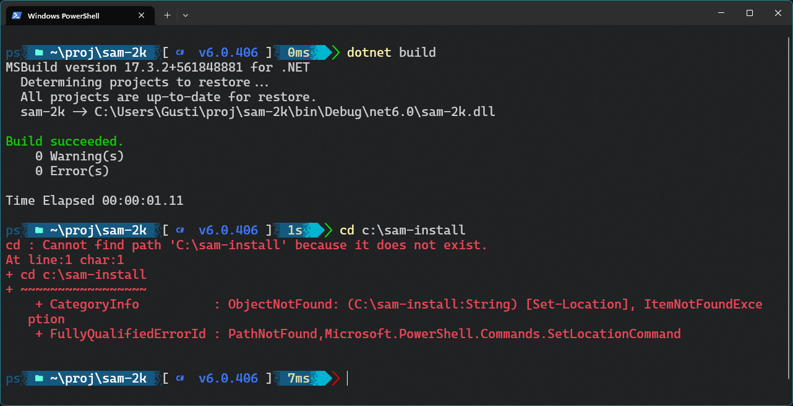

# starship-interrupted-preset

A preset configuration for Starship.

Custom shell prompts offer visual candy.

[Starship](https://starship.rs/) offers some presets exploring some customization options. Presets can be configured by editing the `~/.config/starship.toml` file.

## Screenshots

The Interrupted preset uses blue/green colors for standard content.
Special handling is provided for git and some language specific folders (E.g. Rust)

### Screenshot 1

> Windows Terminal, Powershell, Acrylic, 90% transparency

> Font: Fira Code Nerd Font

> Git, success status

### Screenshot 2

> Windows Terminal, Powershell, Opaque, no transparency

> Font: Fira Code Nerd Font

> Git, Rust, success status

### Screenshot 3

> Windows Terminal, Powershell, Acrylic, 90% transparency

> Font: Caskaydia Cove Nerd Font

> Dotnet, success status (top), fail status (bottom)
