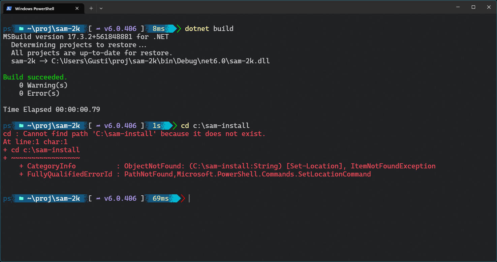
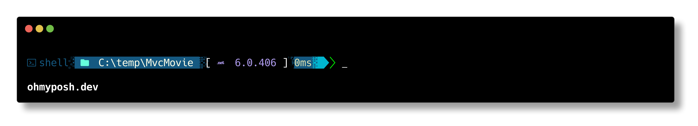
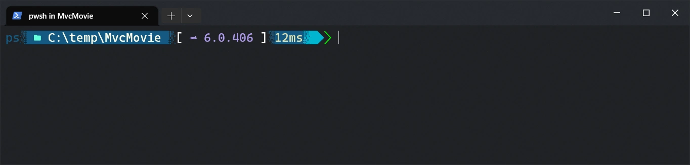

# starship-interrupted-preset

A preset configuration for *Starship* or *OhMyPosh*.

Custom shell prompts offer visual candy.

[Starship](https://starship.rs/) offers some presets exploring some customization options. Presets can be configured by editing the `~/.config/starship.toml` file.

[Oh My Posh](https://ohmyposh.dev/) also allows storing a configuration file, using a different format.

## Configuring

For both options:
> ⚠️ I added / enabled only the configurations I use. Please look in the files and enable the additional information based on what you would like to display (E.g. Go)

For Starship, one of the two:

- starship.toml
- starship.interrupted.toml

For Oh My Posh, use

- .interrupted.omp.json

## Screenshots

The Interrupted preset uses blue/green colors for standard content.
Special handling is provided for git and some language specific folders (E.g. Rust)

### Screenshot 1 (Starship)

> Windows Terminal, Powershell, Acrylic, 90% transparency

> Font: Fira Code Nerd Font

> Git, success status

### Screenshot 2 (Starship)

> Windows Terminal, Powershell, Opaque, no transparency

> Font: Fira Code Nerd Font

> Git, Rust, success status

### Screenshot 3 (Starship)

> Windows Terminal, Powershell, Acrylic, 90% transparency

> Font: Caskaydia Cove Nerd Font

> Dotnet, success status (top), fail status (bottom)

### Screenshot 4 (Oh My Posh)

> Standard picture generated by Oh My Posh for the preset.

### Screenshot 5 (Oh My Posh)

> Windows Terminal, Powershell, Acrylic, 90% transparency

> Font: Caskaydia Cove Nerd Font